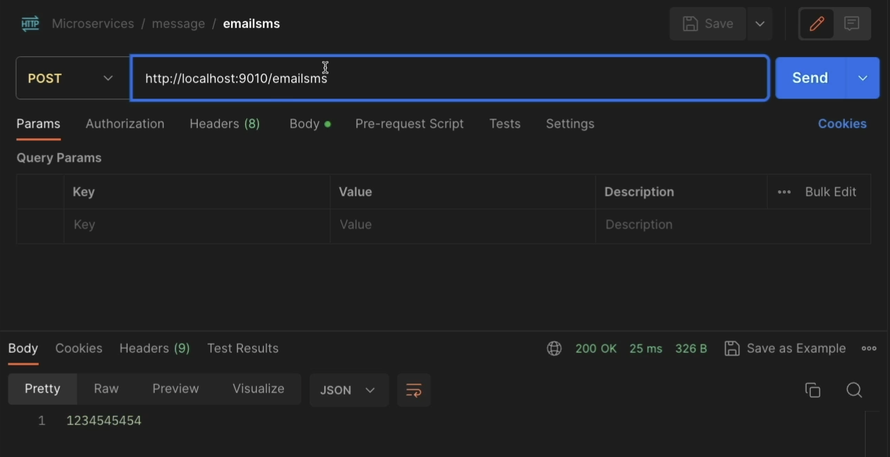

# Event Driven Microservices

RabbitMQ - Pub Sub Model
----------------------
1. Create a microservices using spring cloud functions

2. Define the functions
   ````java

    @Configuration
    public class MessageFunctions {
    
        private static final Logger log = LoggerFactory.getLogger(MessageFunctions.class);
    
        @Bean
        public Function<AccountsMsgDto,AccountsMsgDto> email() {
            return accountsMsgDto -> {
                log.info("Sending email with the details : " +  accountsMsgDto.toString());
                return accountsMsgDto;
            };
        }
    
        @Bean
        public Function<AccountsMsgDto,Long> sms() {
            return accountsMsgDto -> {
                log.info("Sending sms with the details : " +  accountsMsgDto.toString());
                return accountsMsgDto.accountNumber();
            };
        }
    
    }
   ````
3. Merge the functions using properties and invoke them 
4. Add the properties to combine functions
5. ```yaml
    server:
    port: 9010
    
    spring:
    application:
    name: "message"
    cloud:
    function:
    definition: email|sms
   ```
    
4. Add the Spring Cloud Stream dependency and properties message microservice - `Receiver` 
```xml
<dependency>
			<groupId>org.springframework.cloud</groupId>
			<artifactId>spring-cloud-stream</artifactId>
		</dependency>
		<dependency>
			<groupId>org.springframework.cloud</groupId>
			<artifactId>spring-cloud-stream-binder-rabbit</artifactId>
		</dependency>
```
5. Add properties related to spring cloud functions and rabbitmq 
 ```yaml
   server:
   port: 9010
   
   spring:
   application:
   name: "message"
   cloud:
   function:
   definition: email|sms
   stream:
   bindings:
   emailsms-in-0:
   destination: send-communication
   group: ${spring.application.name}
   emailsms-out-0:
   destination: communication-sent
   rabbitmq:
   host: localhost
   port: 5672
   username: guest
   password: guest
   connection-timeout: 10s
```
6. Add the same spring cloud stream and rabbimq dependencies in accounts microservice - `Publisher`
```yaml
      spring:
          stream:
             bindings:
                updateCommunication-in-0:
                   destination: communication-sent
                   group: ${spring.application.name}
                sendCommunication-out-0:
                   destination: send-communication
          rabbitmq:
            host: localhost
            port: 5672
            username: guest
            password: guest
            connection-timeout: 10s
```
7. Send the message tp the queue
   ```java
   private void sendCommunication(Accounts account, Customer customer) {
   var accountsMsgDto = new AccountsMsgDto(account.getAccountNumber(), customer.getName(),
   customer.getEmail(), customer.getMobileNumber());
   log.info("Sending Communication request for the details: {}", accountsMsgDto);
   `var result = streamBridge.send("sendCommunication-out-0", accountsMsgDto);`
   log.info("Is the Communication request successfully triggered ? : {}", result);
   }
   ```
8. Run Rabbit in Docker
9. Run the microservices to create an account that will send the message to the queue
10. 